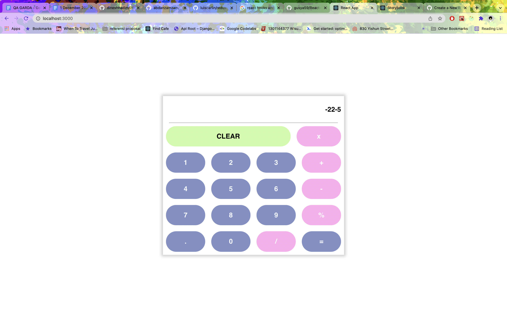

# React-Redux-Calculator
A simple calculator using react, redux and mathjs

``git clone https://github.com/dineshnadimpalli/React-Redux-Calculator.git``

#Go to the React folder

``cd React-Redux-Calculator``

``npm i``

``npm start``

The frontend will now automatically run on port http://localhost:3000

Here are the sample pictures of how the app should look once you successfully clone it and run.

  

  

  

